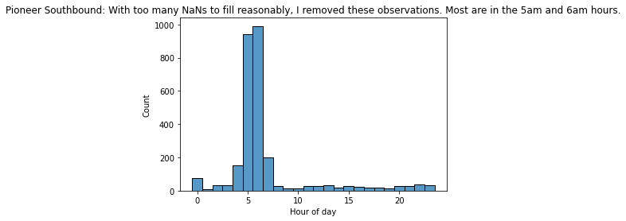

# seattle
Transit ridership prediction on the Seattle light rail.

I am keeping this repository private, because the data was granted to me through a public records request.

**8/15: Currently in the process of nicely organizing this repo. Please explore different sections of the project by reading the individual notebooks in the /notebooks folder.**

**Please refer to Models_Aug02.ipynb for one giant notebook with all work done through 8/8/22.**

## The story (8/18)

1. To get familiar with the dataset, let's look at **which days and times we have observations**:

We have more observations during weekday rush hours. Sound Transit runs more vehicles at those times.

2. Let's look at the **mean passengers** grouped by day of week and hour of day. This mean does not care about station or direction - all observations in a day-of-week-and-hour-of-day bucket are used to compute that bucket's mean, regardless of which station or direction they were.

We see that the mean passenger values have maxima at weekday rush hours. Mon-Thurs have a different pattern than Sat-Sun. Friday is somewhere in between.

3. Let's figure out what kinds of times we might see **crowded observations**. Here's a week in late August 2019 at the Pioneer Square station. Keep in mind each rail vehicle has 74 seats plus standing room.

Looking at the above plot gives us some insights.
- There are more observations with >74 passengers for this station-week than in the dataset in general. By eye it appears that about a quarter of all these observations are >74 passengers, whereas other EDA revealed that only 10% of all observations are >74 passengers.
- The most-crowded times were weekday mornings and weekday evenings
- On weekday mornings, all the most crowded trains were northbound. I assume these crowds are commuters.
- On weekday evenings, all the most crowded trains were southbound. I assume these crowds are the commuters again.
- On Tuesday, Friday, and Saturday, there were also a few very crowded northbound trains around 11pm. I assume these crowds are people having a fun night out. (Perhaps there was an event Tuesday night? A quick Google didn't turn up anything.)

4. Let's find the **seasonal pattern** in crowdedness. A sinusoidal curve is common practice for a seasonal cycle, so that's what we'll fit.

5. Here is **what's left in the data** after we remove that seasonal cycle.

Here I'll stop and address what you may be thinking: October 26-27 and October 12-13 were big dips in passengers. These dips in passengers came from planned construction that closed the downtown section of the line. https://www.soundtransit.org/get-to-know-us/news-events/news-releases/construction-will-close-light-rail-downtown-seattle-three

6. Finally, note that we can remove the **week-period pattern** (i.e. remove the day-of-week specific mean for each day of the week) to get this:

It looks mostly like noise to my eyes, which means we did a good job removing the repeating patterns (year-long and week-long, as explained above.)

7. Let's take a different tack, and try to **understand days better**. I used a dataset of mean passengers, grouped by day of year, hour, and station-direction. I had one row for each day of the year, and collapsed the variance of the 768 columns down to just two PCA components.

We see that one cluster is commuter days - every day in this cluster is a weekday. The other cluster is non-commuter days - this cluster consists of weekends and similar days, like July 5th, Black Friday, and snowstorms. *add more explanation here*

8. Let's take yet a different tack, and try to **understand stations better**. I used a dataset of mean passengers, grouped by station-direction, day of year and hour. I had one row for each station-direction, and collapsed the variance of the 7000 columns down to just two PCA components.

Notice that if you connect the points in the order the train visits them, it's a butterfly shape.

Conclusions from plot:
- PC1 mostly captures city center stations versus outer stations.
- PC2 mostly captures Northbound vs Southbound.

Conclusions from loadings:
  - (from PC2) On weekend mornings, Northbound stops may be more crowded than Southbound.
  - (from PC1) On weekend mornings, city center stops may be more crowded than outer stops.
  - (from PC2) On weekday 4-6pm times, Southbound stops may be more crowded than Northbound stops.
  - (from PC1) On weekday late-nights, outer stops may be more crowded than city center stops.
    - This is explained by the the airport stop and the college stop at either end - both would spur late-night crowds!

9. Next step: Predictive modeling. We'll dedicate a whole section to this.

### Predictive modeling

We are doing fine granularity short-term predictions. Suppose it's 10am and Rachel is considering catching a 10:30am train. Our input data comes from 8am to 10am. How well can we predict the 10:30am train's crowdedness, knowing what happened just recently?

To capture the pattern from 8am to 10am, we split it up into 15-minute increments: 8:00 to 8:15, 8:15 to 8:30, ... , 9:45 to 10:00. In each 15-minute period, we calculate the mean number of passengers observed in any trains that came through.

One more example. Suppose we're predicting passenger crowdedness at 1:42pm on October 6th. Our eight features come from earlier on October 6th. The eight features are: FMP_0 (the mean passengers from 11:12am to 11:27am), FMP_1 (the mean passengers from 11:27am to 11:42am), FMP_2 (the mean passengers from 11:42am to 11:57am), FMP_3 (the mean passengers from 11:57am to 12:12pm), etc., through FMP_7 (the mean passengers from 12:57pm to 1:12pm).

For simplicity, we're *only* working with Pioneer Square station going Southbound.

So, for every target crowdedness (number of passengers in vehicle) that we're trying to predict, we tell the computer to create those eight features. I call each feature an FMP, for Fifteen Minute Period. FMP_0, FMP_1, etc though FMP_7.

Note that we get to dip into the entire dataset to create those features - we're not artificially blinding ourselves to any observations as it pertains to creating features. This is standard practice when working with time series data. However, a separate concept is that we're only working with our training dataset at the moment, which only consists of certain (80%) of the target observations. We won't use those test 20% of targets until the very end after selecting a model.

All right, so our training dataset for Pioneer Square Southbound now has all its features. We have 30000 observations. Now what? I checked for NaNs and found a lot of them! These occur becuae there's often a 15-minute period in which no train shows up. I went with a three-step solution:
1. Remove observations with 5 or more NaN features. This means we get rid of 4000 observations that had many NaN features, and we keep all observations that have at least 4 actual numbers as features. I figure that the ones I got rid of here weren't really actual time series, so weren't appropriate for this model. On the other hand, if an observation had just a one or two NaN features, those could be dealt with using interpolation.
   - Side note: most of those 4000 I removed were in the 5am and 6am hours. See plot below.

2. Of the remaining 26000 observations, I got 18000 to NaN-free after using linear interpolation. This means that if FMP_4 was 27, FMP_5 was NaN, and FMP_6 was 22, then FMP_5 gets filled as 24.5.
3. For the remaining 8000 observations - these ones had multiple consecutive NaNs, so didn't get interpolated - I filled remaining NaNs with 0. I wish there were a better solution, but as it is this logic translates to "if there weren't any trains, then there must not have been any crowdedness". Perhaps most gaps in train service occur when demand is low anyway.

So, we have 26000 observations, all of them have eight features with actual numbers, and we're ready to do some machine learning!

I tried a Linear Regression, Random Forest, and Extra Trees models on both the eight-feature dataset and a four-feature dataset of only FMP_4, FMP_5, FMP_6, and FMP_7. I used 5-fold cross-validation to get score estimates and standard errors. I used a few different scores: RMSE helps describe the model's performance in pur regression terms; precision, recall, f1-score, and confusion matrix describe the model's performance in classification terms, where we threshold our y values at 74 to understand when the vehicle's seats are full.

Reults:

*Need to add bar chart of results here.*
*All results are within /notebooks/Predictive_Models.ipynb for now, will add them here on Friday*

In terms of RMSE, the Random Forest and the Extra Trees - both on the eight feature dataset - performed equally well, with RMSE around 25.6 and within 0.1 standard devations of each other. The other models were not far behind, just 2-3 standard deviations away. From this I conclude that going down to four features actually creates worse model performance, but just slightly worse.

In terms of classification, it was a similar story. Random Forest on eight-feature dataset and Extra Trees on eight-feature dataset both achieved a mean f1-score of 0.69, wheras all other models had an f1-score around 0.65. COnsidering standard deviations were around 0.10, the best models had a significant advantage here.

Next steps could include more types of models (e.g. KNN), some feature engineering (e.g. day of week, month, etc), and trying a different station-direction dataset.

----

That's it for now! All below this sentence is old.

## OLD - Summary of work so far

- Data cleaning
  - Which datapoints can be trusted? If not, remove them.
    - Removed impossibly crowded observations (>210 passwithin)
    - Removed routes with >20 stops (the operator forgot to reset the counter)
    - Removed the 0.2% of routes that do not follow the standard calculation (lastwithin + in - out = currwithin)
    - Removed routes where the train visited stations out-of-sequence
  - Extracted features for time dimensions and booleans for crowding levels
    - Focus on 'Crowded' feature - 74 threshold  corresponds to nbr of seats in vehicle
  - Created IDs for stations and directions

- EDA
  - Crowded state happens disproportionately on weekdays 7-9a and 4-6p - especially Weds and Thurs.
  - Crowded state happens more in Jul-Sep, and less in Jan-Mar
  - On passwithin, fit sinusoidal curve with year period - min of curve is 31 in January and max of 38 in July.

- PCA
  - Find mean passwithin by Hour, Day of Year, and Station-direction
  - PCA on stations
    - Each station-direction represented via passenger patterns by hour by day
    - Remove 1am, 2zm, 3am, 4am hours due to too few observations (many NaNs)
    - Fill remaining NaNs using interpolation (previous hour and next hour)
    - PCA brings 7000-ish dimensions down to just 2 components representing 83% of the variance
    - Plot stations in PC-space - reveals butterfly shape
    - Add more variables to plot: find Northbound wing and Southbound wing of butterfly.
    - PC1 mostly captures city center stations versus outer stations.
    - PC2 mostly captures Northbound vs Southbound.
    - Further conclusions based on PC loadings are in the latest notebook.
  - PCA on days
    - Each day represented via passenger patterns by hour by station-direction
    - Fill NaNs with 0.
    - PCA brings 750 dimensions down to 2 components representing 40% of the variance
    - Plot days in PC-space - reveals 2 clusters byeye
    - Explore clustering methods to capture this; settle on Gaussian Mixture
    - Add more variables to plot: find Workday cluster and Weekend-Holiday cluster
    - identified non-Weekend non-Holidays in latter claster as either snowstorms or near-holidays such as July 5th or Black Friday.

- Predictive modeling
  - Test/train datasets; cross validation and readout functions with precision, recall, and f1-score
  - Baseline models
    - Classification: predict whether target Crowded is True or False.
    - One-hot features: station, direction, hour of day, day of week, month
    - Logistic Regression and Random Forest
    - Best f1 score from Random Forest with class_weight = 'balanced'. Scores at 0.50.
    - Precision/recall tradeoffs for different models and class_weight parameter.
  - Attempts at creative scoring
    - Wanted to incorporate regression - would allow using sinusoid-subtracted values
      - Fit linear regression and scored as classfication - 0 or near-0 predictions of >74 - not useful
    - Tried removing 70-79 passenger values to help classifier focus on the important distinction - success, but need more proof that this is best

### OLD - Next steps
  - Compare predictive models
    - Try using features from PCA and seasonal trend
    - Try regression-based approaches and classification-based approaches
      - Regression-based approaches may need to add a standard error to prediction in order to improve recall
    - Try training on borderline-removed dataset, but compare to other models using apples-to-apples evaluation
    - Try classification with 3 different classes
  - Gather key figures in the same place
  - Make more visual figures to show my results
  - Wish list: PCA on Crowded variable; Day PCA using interpolation; spectral analysis of periodic trends
